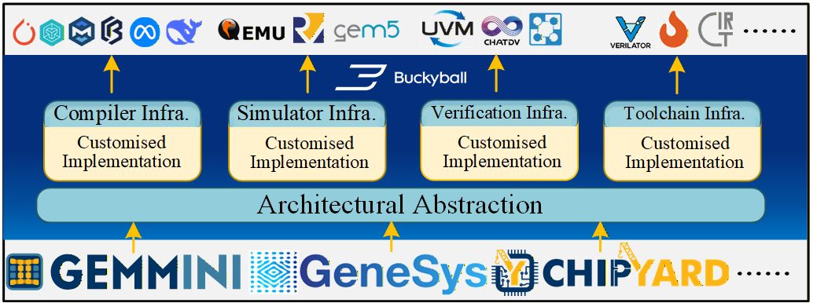

## Introduction

Buckyball is an end-to-end architecture and algorithm framework designed for Domain-Specific Architectures (DSAs) and Domain-Specific Languages (DSLs). Our mission is to deliver a powerful, scalable, and high-performance next-generation ML infrastructure.

## Contact Us

- Buckyball is actively under development. If you are passionate about open source and enjoy MLSys, whether you're interested in learning, contributing or collaborating on research, you are welcome to join us. **Have a ball here and let’s keep the ball rolling!**

- Email: zhejiang.arch@gmail.com
